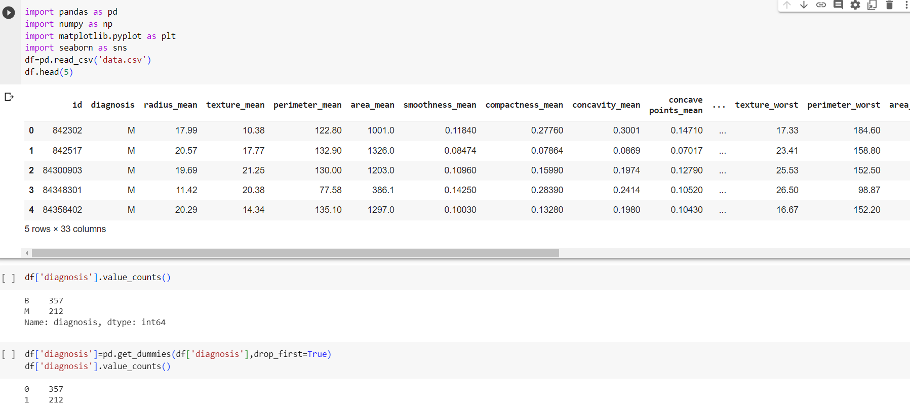
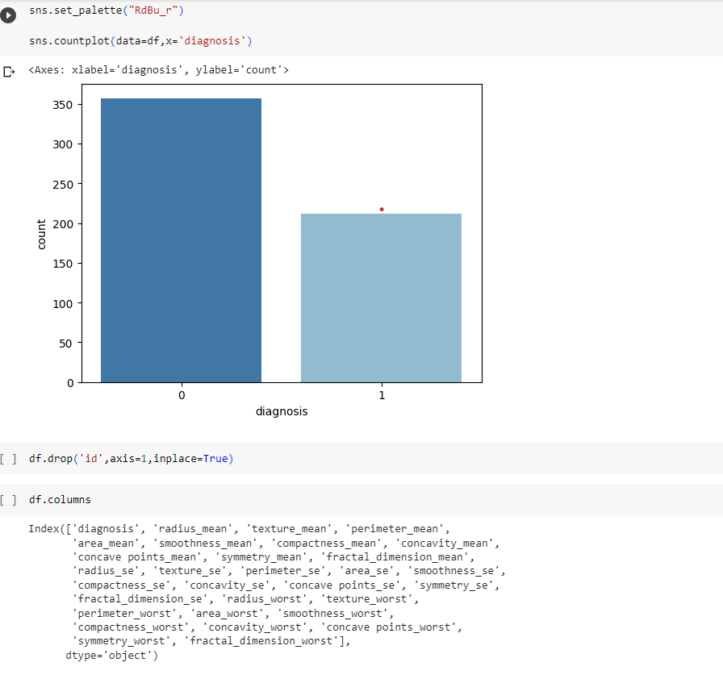
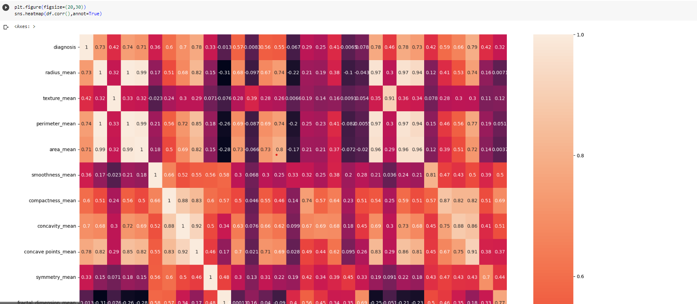
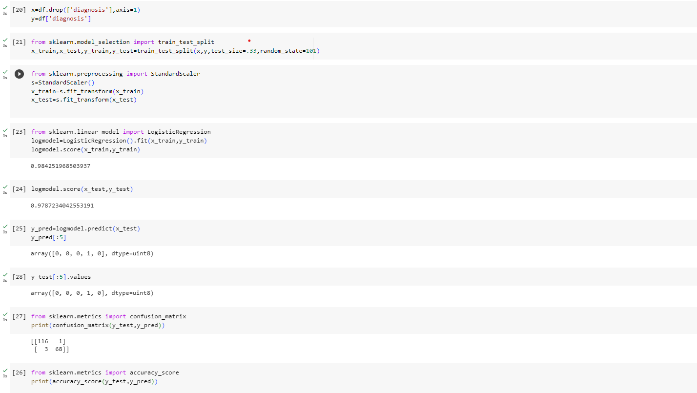
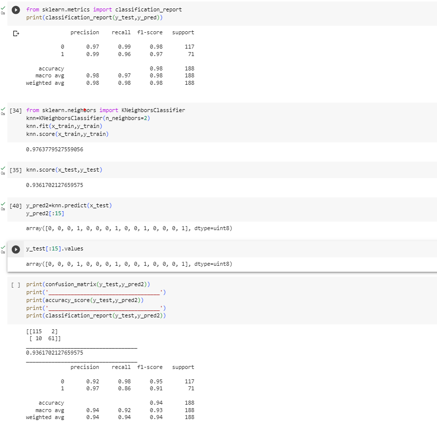
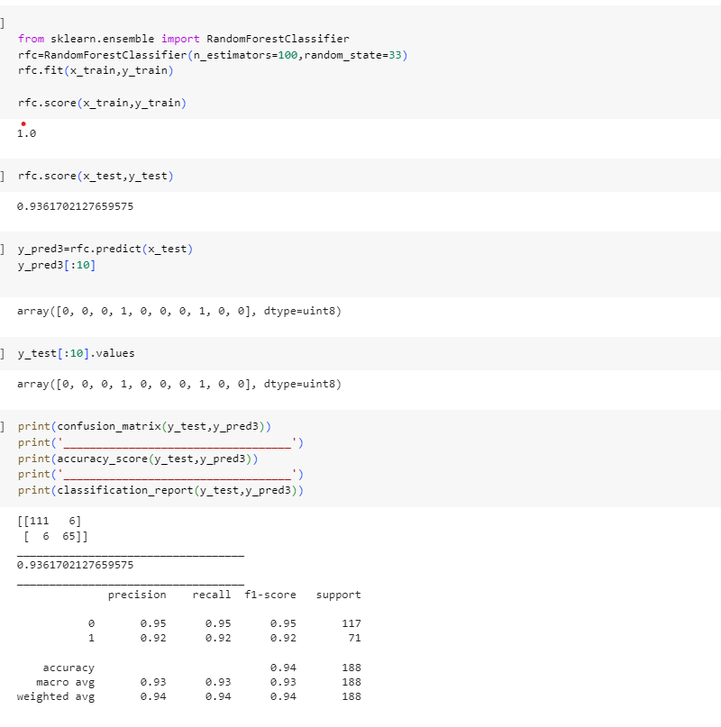
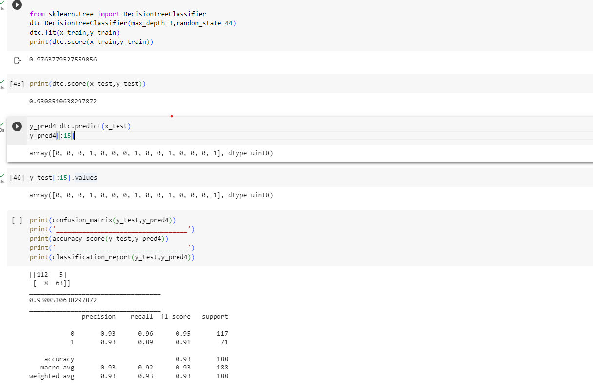
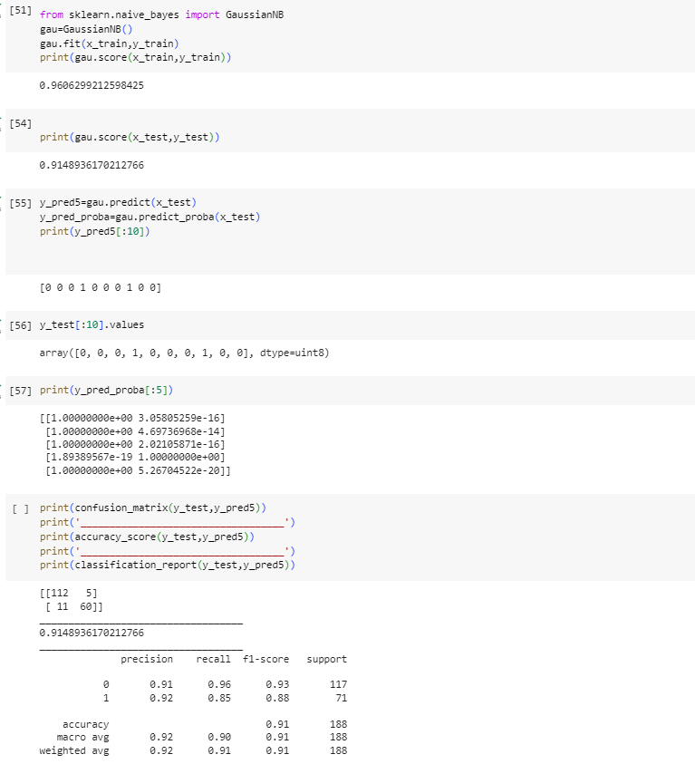

># PYTHON-Analyzing and MACHINE-BREAST CANCER DETECTION
## What makes name timeless or trendy?
Using data published by the US Social Security Administration, which extends over a period of **one hundred years** to determine whether a resident has cancer or not.

## Creating and importing data 

```
import pandas as pd
import numpy as np
import matplotlib.pyplot as plt
import seaborn as sns
df=pd.read_csv('data.csv')
df.head(5)
df['diagnosis'].value_counts()
df['diagnosis']=pd.get_dummies(df['diagnosis'],drop_first=True)
df['diagnosis'].value_counts()

```
-----------------

------------------------
------------------------
## ANALYSIS
##:1 
```
df.drop(columns='Unnamed: 32',inplace=True)
sns.set_palette("RdBu_r")
sns.countplot(data=df,x='diagnosis')
df.drop('id',axis=1,inplace=True)
df.describe().T
```




----------------------------------
-----------------------------------
## CORRELATION
```
plt.figure(figsize=(20,30))
sns.heatmap(df.corr(),annot=True)
```


------------------------------------
-----------------------------------
## logisticregression model
```
from sklearn.linear_model import LogisticRegression
logmodel=LogisticRegression().fit(x_train,y_train)
logmodel.score(x_train,y_train)
logmodel.score(x_test,y_test)
y_pred=logmodel.predict(x_test)
y_pred[:5]
```
------------------------

------------------------
## KNeighborsClassifier model
```
from sklearn.neighbors import KNeighborsClassifier
knn=KNeighborsClassifier(n_neighbors=2)
knn.fit(x_train,y_train)
knn.score(x_train,y_train)
```
---------------


------------------------
>## RandomForestClassifier model
```
from sklearn.ensemble import RandomForestClassifier
rfc=RandomForestClassifier(n_estimators=100,random_state=33)
rfc.fit(x_train,y_train)

rfc.score(x_train,y_train)
rfc.score(x_test,y_test)
y_pred3=rfc.predict(x_test)
y_pred3[:10]

```
------------------------

---------------------------
## decisiontreeclassifier model
```
from sklearn.tree import DecisionTreeClassifier
dtc=DecisionTreeClassifier(max_depth=3,random_state=44)
dtc.fit(x_train,y_train)
print(dtc.score(x_train,y_train))
print(dtc.score(x_test,y_test))
y_pred4=dtc.predict(x_test)
y_pred4[:15]
```
----------------------

--------------------------
## GaussianNB model
```

from sklearn.naive_bayes import GaussianNB
gau=GaussianNB()
gau.fit(x_train,y_train)
print(gau.score(x_train,y_train))
print(gau.score(x_test,y_test))
y_pred5=gau.predict(x_test)
y_pred_proba=gau.predict_proba(x_test)
print(y_pred5[:10])
y_test[:10].values
print(y_pred_proba[:5])

```
------------------

---------------------------



------------------------------------

-------------------------------
### THANK YOU♥
